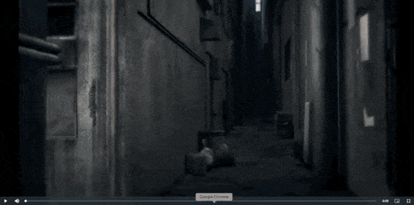

# Miteiru (見ている)

Miteiru is an open source Electron video player to learn Japanese. It has modular main language dictionary and tokenizer (morphological analyzer), heavily based on External software [MeCab](https://taku910.github.io/mecab/), and optinally needs [JMDict](https://github.com/scriptin/jmdict-simplified) to give language info box. This software is heavily inspired by [Anisubber](https://ookii-tsuki.github.io/Anisubber/). 

## What can 見ている do?

- Cross-platform! Available in MacOS, GNU/Linux.
- Supports all videos that your [chromium](https://www.chromium.org/audio-video/) supports! In some OS's, it supports **x265**.
- On-The-Fly Furigana generation! blazing-fast and no cache build needed.
- Instant definition of any terms that uses LevelDB on first start only!
- Instant definition of any word in the subtitles.
- Translation subtitles alongside the Japanese subtitles.
- Word/Token spacing in the Japanese subtitles 

## Installation Guide

The alpha version will mostly be tested on Darwin/ARM64 M1 Mac. Other build will be made in the future. To directly run the edge version of the app in dev environment, you can run the followings on the cloned repository:

```bash
npm install
npm run dev
```

Mecab can be downloaded through [brew](https://brew.sh/) by running:

```bash
brew install mecab
```

or in Ubuntu:

```bash
sudo apt install mecab
```

Then, you can run

```bash
which mecab
```

to show your default mecab binary file. Use it as the path when asked in Miteiru. Then, you can get JMDict Dictionary in [https://github.com/scriptin/jmdict-simplified/releases](https://github.com/scriptin/jmdict-simplified/releases). Use it as the path when asked in Miteiru as well. Miteiru will build a LevelDB cache locally. Then, you can enjoy the app!

## MeCab Dictionary Customization

By default, you are using whatever your default Mecab Dictionary offers you, but you can further customize this by modifying the `mecabrc` file which is located in `/opt/homebrew/etc/mecabrc` in MacOS, `C:\Program Files (x86)\MeCab\etc\mecabrc` in Windows, and `/etc/mecabrc` in Ubuntu. For other OS's you gotta figure it our for yourself right now. Shunou, Miteiru's microlibrary can support Unidic, Jumandic, Ipadic, and it's variations. Specifically, if you check out the `dicrc` file of each dictionary, Shunou can support the output format `chamame`, `chasen`, and the classic Jumandic god knows what output format. You can get [UniDic files here](https://clrd.ninjal.ac.jp/unidic/en/)

Configuration file in mac:
```
;
; Configuration file of MeCab
;
; $Id: mecabrc.in,v 1.3 2006/05/29 15:36:08 taku-ku Exp $;
;
; dicdir =  /opt/homebrew/lib/mecab/dic/ipadic
; dicdir =  /opt/homebrew/lib/mecab/dic/jumandic
dicdir =  /opt/homebrew/lib/mecab/dic/unidic
; userdic = /home/foo/bar/user.dic

; output-format-type = wakati
; input-buffer-size = 8192

; node-format = %m\n
; bos-format = %S\n
; eos-format = EOS\n
```

## Future Enhancements

- Verb inflections 
- Miteiru will be ported to a dedicated media player, like LibVLC or MPV.
- Kanji explanation in the subtitles with animated diagrams.
- Pronounciation audio
- Customizable subtitle style.
- Online hosted videos.
- Will support Android and Windows.
- Miteiru will have built-in Tokenizer and Dictionary, and supports French, German, Bahasa Indonesia, and many more.
- Miteiru will support Chinese and Korean too!


