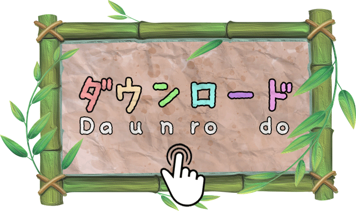

# Miteiru (見ている) / zai⁴kan⁴ (在看) / tai²gan² (睇緊) / đang xem

[](https://creativecommons.org/licenses/by-nc-sa/4.0/)


## Disclaimers
### About the Developer
Hello! I'm **Hocky Yudhiono**, the developer behind **Miteiru**. I created this video player app with the goal of providing a reliable and user-friendly experience for watching your favorite videos.

### Commitment to Security

I am **dedicated to ensuring that Miteiru is secure and free from any malicious components**. However, if you encounter any security issues or vulnerabilities, please reach out to me privately at [miteiru@hocky.id](mailto:miteiru@hocky.id) or just submit a GitHub issue, and I will do my best to address and resolve them promptly.

### Liability Disclaimer
While I strive to maintain a safe and secure application, I cannot be held responsible for any unintended consequences or damages that may occur from using **Miteiru**. **Use the app at your own risk**.

## Download ૮ ˶ᵔ ᵕ ᵔ˶ ა✩°｡ ⋆⸜
<div align="center">

<a href="https://github.com/hockyy/miteiru/releases/latest" target="_blank" rel="noopener noreferrer">

</a>
<a href="https://github.com/hockyy/miteiru/releases/latest" target="_blank" rel="noopener noreferrer">

</a>
<a href="https://github.com/hockyy/miteiru/releases/latest" target="_blank" rel="noopener noreferrer">

</a>
</div>

<table style="border: none;">
  <tr>
    <td></td>
    <td> Miteiru is an open source Electron video player for learning Japanese, Mandarin, Cantonese, and Vietnamese. It tokenizes subtitles (Kuromoji, Jieba, optional <a href="https://taku910.github.io/mecab/">MeCab</a>), shows readings and dictionary info from bundled <a href="https://github.com/scriptin/jmdict-simplified">JMDict</a>, CC-CEDICT, and VNEDict, and is heavily inspired by <a href="https://ookii-tsuki.github.io/Anisubber/">Anisubber</a>.

📚 **Language details:** [Language Documentation](README_LANGUAGES.md)</td>
  </tr>
</table>

## What can 見ている do?

- **Japanese, Mandarin, Cantonese, and Vietnamese** — tokenization, readings (furigana / pinyin / jyutping), and click-to-define
- **Bundled dictionaries** — JMDict, KanjiDic, CC-CEDICT, CC-Canto, VNEDict, Japanese pitch accent
- Local video files (whatever [Chromium](https://www.chromium.org/audio-video/) can play; some OSes also play **x265**) plus **YouTube** URLs
- Primary + secondary (translation) subtitles, karaoke mode with LRCLIB lyrics search, Anki export, notes
- Cross-platform: Windows, macOS, GNU/Linux

## How to start immersing

- Pick a language on the home screen (dictionaries ship with the installer).
- Drag in a video, or paste a YouTube URL with Ctrl+V. External subtitles can be dropped the same way; many anime subs live at https://kitsunekko.net/
- YouTube Japanese only appears when the video has Japanese CC (including auto-generated).
- `X` / `Z` open settings. Shortcuts are on the home screen; `Q` or Ctrl+H goes back there.


## Installation

Releases: https://github.com/hockyy/miteiru/releases

### Mac

- Download the `.pkg`. Builds are unsigned (no Apple Developer Program), so macOS will warn about an unidentified developer. The code is open source — [open anyway](https://support.apple.com/guide/mac-help/open-a-mac-app-from-an-unidentified-developer-mh40616/mac), or build it yourself below.


### Windows

- NSIS installer and portable `.exe` are both on the release. Some PCs flag the installer; the source is here if you want to verify.

### Linux

- `.deb` and AppImage for Ubuntu 22.04 and 24.04.

## For developers

Needs **Node.js 22.12+**. `script:initrepo` downloads language assets from the [assets release](https://github.com/hockyy/miteiru/releases/tag/assets) into `renderer/public/language-assets`.

```bash
npm install
npm run script:initrepo
npm run dev
npm run build:nsis       # Windows installer (includes Live Captions helper)
npm run build:portable   # Windows portable
npm run build:linux22    # Ubuntu 22.04
npm run build:linux24    # Ubuntu 24.04
npm run build:linux26    # Ubuntu 26.04
npm run build:macos      # macOS .pkg
```

Language assets:

```bash
npm run script:download-language-assets
npm run script:pack-language-assets
npm run script:unpack-language-assets
npm run script:download-language-assets -- mandarin han-character-core
```

`MITEIRU_FORCE_ASSET_DOWNLOAD=1` redownloads existing zips.

## Optional MeCab

Built-in Kuromoji is enough for Japanese. MeCab is optional.

```bash
brew install mecab          # macOS
sudo apt install mecab      # Ubuntu
which mecab                 # path to paste into Miteiru
```

Windows binaries: [SourceForge](https://sourceforge.net/projects/mecab/). JMDict is already bundled; you can point at a custom dump from [jmdict-simplified](https://github.com/scriptin/jmdict-simplified/releases) if you want.

To change the MeCab dictionary, edit `mecabrc` (`/opt/homebrew/etc/mecabrc` on macOS, `C:\Program Files (x86)\MeCab\etc\mecabrc` on Windows, `/etc/mecabrc` on Ubuntu) and set `dicdir` to ipadic, jumandic, or unidic. Miteiru accepts `chamame`, `chasen`, and Jumandic output. [UniDic](https://clrd.ninjal.ac.jp/unidic/en/).

https://user-images.githubusercontent.com/19528709/236619520-076c863a-6c14-4f6e-8f9b-5d1e660fd646.mp4
